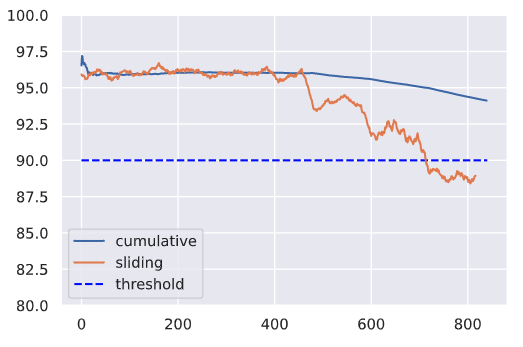

# Supervisión de los sistemas de Machine Learning

Aprenda a supervisar los sistemas de ML para identificar y abordar las fuentes de desviación para evitar el deterioro del rendimiento del modelo.

## Introducción

Aunque hayamos entrenado y evaluado a fondo nuestro modelo, el verdadero trabajo comienza una vez que lo desplegamos en producción.
Esta es una de las diferencias fundamentales entre la ingeniería de software tradicional y el desarrollo de ML.
Tradicionalmente, con el software determinista basado en reglas, la mayor parte del trabajo se realiza en la fase inicial y,
una vez desplegado, nuestro sistema funciona tal y como lo hemos definido.
Pero con el aprendizaje automático, no hemos definido explícitamente cómo funciona algo, sino que hemos utilizado los datos para diseñar una solución probabilística.
Este enfoque está sujeto a una degradación natural del rendimiento a lo largo del tiempo, así como a un comportamiento involuntario,
ya que los datos expuestos al modelo serán diferentes de aquellos con los que ha sido entrenado.
Esto no es algo que debamos tratar de evitar, sino más bien comprender y mitigar en la medida de lo posible.

## Salud del sistema

El primer paso para asegurar que nuestro modelo está funcionando bien es asegurarse de que el sistema real está funcionando como debería.
Esto puede incluir métricas específicas de las solicitudes de servicio, como la latencia, el rendimiento, las tasas de error, etc.,
así como la utilización de la infraestructura, tal como uso de CPU/GPU, memoria, etc.
La mayoría de los proveedores de la nube, e incluso las capas de orquestación, nos proporcionarán esta visión de la salud de nuestro sistema de forma gratuita a través de un dashboard.

## Performance

La siguiente capa de métricas que hay que supervisar tiene que ver con el rendimiento del modelo.
Puede tratarse de métricas de evaluación cuantitativas que hayamos utilizado durante la evaluación del modelo (exactitud, precisión, f1, etc.),
pero también de métricas de negocio clave en las que el modelo influye (ROI, tasa de clics, etc.).
Por lo general, nunca es suficiente con analizar las métricas de rendimiento acumuladas a lo largo de todo el periodo de tiempo desde que el modelo se ha desplegado.
En su lugar, deberíamos inspeccionar también el rendimiento a lo largo de un periodo de tiempo que sea significativo para nuestra aplicación.
Estas métricas deslizantes podrían ser más indicativas de la salud de nuestro sistema y podríamos ser capaces de identificar los problemas más rápidamente al no oscurecerlos con datos históricos.

```python
import matplotlib.pyplot as plt
import numpy as np
import seaborn as sns
sns.set_theme()
```

```python
# Generar datos
hourly_f1 = list(np.random.randint(low=94, high=98, size=24*20)) + \
            list(np.random.randint(low=92, high=96, size=24*5)) + \
            list(np.random.randint(low=88, high=96, size=24*5)) + \
            list(np.random.randint(low=86, high=92, size=24*5))
```

```python
# f1 acumulativo
cumulative_f1 = [np.mean(hourly_f1[:n]) for n in range(1, len(hourly_f1)+1)]
print (f"F1 promedio acumulado en el último día: {np.mean(cumulative_f1[-24:]):.1f}")
```

```python
# f1 corredizo
window_size = 24
sliding_f1 = np.convolve(hourly_f1, np.ones(window_size)/window_size, mode="valid")
print (f"Deslizamiento promedio de f1 en el último día: {np.mean(sliding_f1[-24:]):.1f}")
```

```python
plt.ylim([80, 100])
plt.hlines(y=90, xmin=0, xmax=len(hourly_f1), colors="blue", linestyles="dashed", label="threshold")
plt.plot(cumulative_f1, label="cumulative")
plt.plot(sliding_f1, label="sliding")
plt.legend()
```



Puede que necesitemos monitorizar las métricas en varios tamaños de ventana para detectar la degradación del rendimiento lo antes posible.
En este caso estamos monitorizando el f1 global, pero podemos hacer lo mismo con slices de datos, clases individuales, etc.

## Resultados retrasados

Es posible que no siempre dispongamos de los resultados reales para determinar el rendimiento del modelo en producción. Para mitigar esto, podríamos:

* idear una señal aproximada que nos ayude a estimar el rendimiento del modelo. Por ejemplo, en nuestra tarea de predicción de etiquetas, podríamos utilizar las etiquetas reales
  que un autor atribuye a un proyecto como etiquetas intermedias hasta que tengamos etiquetas verificadas a partir de un proceso de anotación.
* etiquetar un pequeño subconjunto de nuestro conjunto de datos en vivo para estimar el rendimiento. Este subconjunto debería intentar ser representativo de las distintas distribuciones de los datos reales.

## Ponderación de la importancia

Sin embargo, las señales aproximadas no siempre están disponibles para todas las situaciones porque no hay retroalimentación sobre las salidas del sistema ML o está demasiado retrasada.
Para estas situaciones, una línea de investigación reciente se basa en el único componente que está disponible en todas las situaciones: los datos de entrada.
La idea central es desarrollar funciones slicing que puedan capturar potencialmente las formas en que nuestros datos pueden experimentar un cambio de distribución.
Estas funciones deben capturar slice obvios, como las etiquetas de clase o diferentes valores de features categóricos, pero también slices basados en metadatos implícitos.
Estas funciones de slice se aplican a nuestro conjunto de datos etiquetados para crear matrices con las etiquetas correspondientes. Las mismas funciones se aplican a nuestros datos de producción
no etiquetados para aproximar lo que serían las etiquetas ponderadas. Con esto, podemos determinar el rendimiento aproximado. La intuición aquí es que podemos aproximar mejor el rendimiento
en nuestro conjunto de datos sin etiquetar basándonos en la similitud entre la matriz de slices etiquetados y la matriz de slices sin etiquetar.
Una dependencia central de esta suposición es que nuestras funciones de slice son lo suficientemente completas como para capturar las causas del cambio de distribución.

## Drift

En primer lugar, debemos comprender los diferentes tipos de problemas que pueden hacer que el rendimiento de nuestro modelo decaiga (model drift).
La mejor manera de hacerlo es observar todas las piezas móviles de lo que estamos tratando de modelar y cómo cada una de ellas puede experimentar un desfase.

| Entidad      | Descripción | Drift |
| ----------- | ----------- | ----------- |
| X      | entradas (features)       | data drift -> P(X) != Pref(X) |
| y   | salidas (ground-truth)        | target drift -> P(y) != Pref(y) |
| P(y/X)    | relación actual entre X e y       | concept drift -> P(y/X) != Pref(y/X) |

### Data drift

Data drift se produce cuando la distribución de los datos de producción es diferente a la de los datos de entrenamiento.
El modelo no está preparado para hacer frente a este desfase y, por tanto, sus predicciones pueden no ser fiables.
La causa real puede atribuirse a cambios naturales en el mundo real, pero también a problemas sistémicos como la falta de datos, errores de canalización, cambios de esquema, etc.
Es importante inspeccionar los datos desviados y rastrearlos a lo largo de su canalización para identificar cuándo y dónde se introdujo la desviación.

### Target drift

También podemos experimentar una deriva en nuestros resultados. Esto puede ser un cambio en las distribuciones, pero también la eliminación o adición de nuevas clases con tareas categóricas.
Aunque el reentrenamiento puede mitigar el deterioro del rendimiento causado por la deriva de los datos,
a menudo puede evitarse con una comunicación adecuada entre líneas sobre nuevas clases, cambios de esquema, etc.

### Concept drift

Además de la deriva de los datos de entrada y de salida, también podemos ver que la relación actual entre ellos también se desvíe.
Este desvio hace que nuestro modelo sea ineficaz porque los patrones que aprendió a trazar entre las entradas y salidas originales ya no son relevantes.

## Localización del desfase

Ahora que hemos identificado los diferentes tipos de desfase, tenemos que aprender a localizarla y a medirla con frecuencia. Estas son las limitaciones que debemos tener en cuenta:

* ventana de referencia: el conjunto de puntos con los que se comparan las distribuciones de datos de producción para identificar el desafase.
* ventana de prueba: el conjunto de puntos que se comparan con la ventana de referencia para determinar si se ha producido un desafase.

Dado que se trata de una detección de desviaciones en línea, podemos emplear un enfoque de ventana fija o deslizante para identificar nuestro conjunto de puntos para la comparación.
Normalmente, la ventana de referencia es un subconjunto fijo y reciente de los datos de entrenamiento, mientras que la ventana de prueba se desliza en el tiempo.
[Scikit-multiflow](https://scikit-multiflow.github.io/) proporciona un conjunto de herramientas para las técnicas de detección de concept drift directamente en los datos de flujo.
El paquete ofrece la funcionalidad de ventanas y medias móviles e incluso métodos en torno a conceptos como la deriva conceptual gradual.

## Midiendo el desfase

Una vez que tenemos la ventana de puntos que queremos comparar, necesitamos saber cómo compararlos.

```python
import great_expectations as ge
import json
import pandas as pd
from urllib.request import urlopen
```

```python
# Cargar proyectos etiquetados
projects = pd.read_csv("https://raw.githubusercontent.com/GokuMohandas/Made-With-ML/main/datasets/projects.csv")
tags = pd.read_csv("https://raw.githubusercontent.com/GokuMohandas/Made-With-ML/main/datasets/tags.csv")
df = ge.dataset.PandasDataset(pd.merge(projects, tags, on="id"))
df["text"] = df.title + " " + df.description
df.drop(["title", "description"], axis=1, inplace=True)
df.head(5)
```

### Expectativas

La primera forma de medición puede estar basada en reglas, como la validación de las expectativas en torno a los valores que faltan, los tipos de datos, los rangos de valores, etc..
La diferencia con las pruebas de datos es que ahora validaremos las expectativas en datos de producción en vivo.

```python
# Datos de producción simulados
prod_df = ge.dataset.PandasDataset([{"text": "hello"}, {"text": 0}, {"text": "world"}])
```

```python
# Suite de expectativas
df.expect_column_values_to_not_be_null(column="text")
df.expect_column_values_to_be_of_type(column="text", type_="str")
expectation_suite = df.get_expectation_suite()
```

```python
# Validar datos de referencia
df.validate(expectation_suite=expectation_suite, only_return_failures=True)["statistics"]
```

```python
# Validar datos de producción
prod_df.validate(expectation_suite=expectation_suite, only_return_failures=True)["statistics"]
```

Una vez que hayamos validado nuestras expectativas basadas en reglas, tenemos que medir cuantitativamente el desafase en los diferentes features de nuestros datos.

### Univariado

Nuestra tarea puede incluir características univariantes (1D) que querremos controlar.
Aunque hay muchos tipos de pruebas de hipótesis que podemos utilizar, una opción popular es la prueba de Kolmogorov-Smirnov (KS).

**Kolmogorov-Smirnov (KS) test**
El test KS determina la distancia máxima entre las funciones de densidad acumulativa de dos distribuciones.
En este caso, mediremos si hay alguna deriva en el tamaño de nuestro feature de texto de entrada entre dos subconjuntos de datos diferentes.

```python
from alibi_detect.cd import KSDrift


# Referencia
df["num_tokens"] = df.text.apply(lambda x: len(x.split(" ")))
ref = df["num_tokens"][0:200].to_numpy()
plt.hist(ref, alpha=0.75, label="reference")
plt.legend()
plt.show()
```

```python
# Inicializar detector de deriva
length_drift_detector = KSDrift(ref, p_val=0.01)
```

```python
# No drift
no_drift = df["num_tokens"][200:400].to_numpy()
plt.hist(ref, alpha=0.75, label="reference")
plt.hist(no_drift, alpha=0.5, label="test")
plt.legend()
plt.show()
```

```python
length_drift_detector.predict(no_drift, return_p_val=True, return_distance=True)
```

```python
# Drift
drift = np.random.normal(30, 5, len(ref))
plt.hist(ref, alpha=0.75, label="reference")
plt.hist(drift, alpha=0.5, label="test")
plt.legend()
plt.show()
```

```python
length_drift_detector.predict(drift, return_p_val=True, return_distance=True)
```

**Chi-squared test**
Del mismo modo, para los datos categóricos, podemos aplicar la prueba chi-squared de Pearson para determinar si una frecuencia de eventos en la producción es coherente con una distribución de referencia.

```python
from alibi_detect.cd import ChiSquareDrift


# Referencia
df.token_count = df.num_tokens.apply(lambda x: "small" if x <= 10 else ("medium" if x <=25 else "large"))
ref = df.token_count[0:200].to_numpy()
plt.hist(ref, alpha=0.75, label="reference")
plt.legend()
```

```python
# Inicializar detector de deriva
target_drift_detector = ChiSquareDrift(ref, p_val=0.01)
```

```python
# No drift
no_drift = df.token_count[200:400].to_numpy()
plt.hist(ref, alpha=0.75, label="reference")
plt.hist(no_drift, alpha=0.5, label="test")
plt.legend()
plt.show()
```

```python
target_drift_detector.predict(no_drift, return_p_val=True, return_distance=True)
```

```python
# Drift
drift = np.array(["small"]*80 + ["medium"]*40 + ["large"]*80)
plt.hist(ref, alpha=0.75, label="reference")
plt.hist(drift, alpha=0.5, label="test")
plt.legend()
plt.show()
```

```python
target_drift_detector.predict(drift, return_p_val=True, return_distance=True)
```

### Multivariado

La medición de la deriva es bastante sencilla para los datos univariados, pero difícil para los datos multivariados.
Resumiremos el enfoque de reducción y medición que se expone en el siguiente documento: [Failing Loudly: An Empirical Study of Methods for Detecting Dataset Shift](https://arxiv.org/abs/1810.11953).
Hemos vectorizado nuestro texto utilizando tf-idf, que tiene una alta dimensionalidad y no es semánticamente rico en contexto.
Sin embargo, normalmente con el texto se utilizan incrustaciones de palabras/caracteres. Así que para ilustrar cómo sería la detección de desfase en datos multivariados,
vamos a representar nuestro texto utilizando incrustaciones preentrenadas.
Empezaremos cargando el tokenizador desde un modelo preentrenado.

```python
from transformers import AutoTokenizer


model_name = "allenai/scibert_scivocab_uncased"
tokenizer = AutoTokenizer.from_pretrained(model_name)
vocab_size = len(tokenizer)
print (vocab_size)
```

```python
# Tokenizar entradas
encoded_input = tokenizer(df.text.tolist(), return_tensors="pt", padding=True)
ids = encoded_input["input_ids"]
masks = encoded_input["attention_mask"]
```

```python
# Decode
print (f"{ids[0]}\n{tokenizer.decode(ids[0])}")
```

```python
# Tokens de subpalabras
print (tokenizer.convert_ids_to_tokens(ids=ids[0]))
```

A continuación, cargaremos los pesos del modelo preentrenado y utilizaremos el objeto TransformerEmbedding para extraer las incrustaciones del estado oculto.

```python
from alibi_detect.models.pytorch import TransformerEmbedding

# Capa de incrustación
emb_type = "hidden_state"
layers = [-x for x in range(1, 9)]  # last 8 layers
embedding_layer = TransformerEmbedding(model_name, emb_type, layers)
```

```python
# Dimensión de incrustación
embedding_dim = embedding_layer.model.embeddings.word_embeddings.embedding_dim
embedding_dim
```
